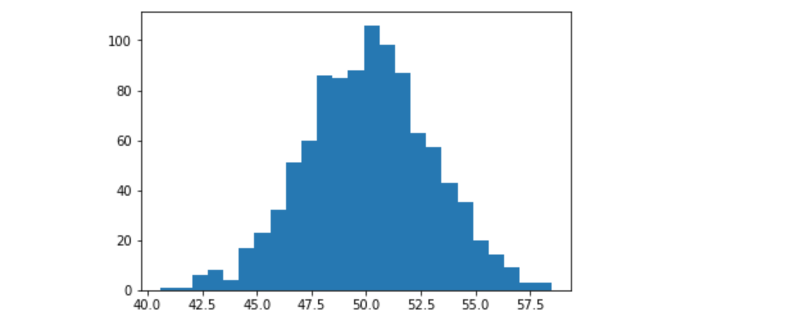

<script type="text/javascript"
        src="https://cdnjs.cloudflare.com/ajax/libs/mathjax/2.7.0/MathJax.js?config=TeX-AMS_CHTML"></script>
        
# Tensorflow Part I

## Goals

- Constants
- Variables
- Simple operations
- Session execution, eval and run
- Graph in tensorboard
- Placeholder, feeding in loops
- Simple file reading

## 1. Create a new notebook

Create a new notebook (`python3` kernel), add the required imports:

```
import tensorflow as tf
```

## 2. Create a session with simple operations

We start a tensorflow session, create a constant and print the shape as defined by tensorflow (`tf.shape`) and the numpy shape applied to underlying tensor value.

```
with tf.Session():
    input0 = tf.constant(10.0)
    print(tf.shape(input0))
    print(input0.shape)    
```

The result is:

```
Tensor("Shape:0", shape=(0,), dtype=int32)
()
```

The first line is a Tensor defining the shape with id `Shape:0`, it is a tensor of rank 0 (`scalar` value).
 
## 3. Explore Higher Rank tensor shapes
 
 Create tensors (`tf.constant()`) and display shapes of arrays and multidimensional arrays:
 
```
[1.0, 1.0, 1.0, 1.0]

[[1.0, 1.0, 1.0, 1.0], [2.0, 2.0, 2.0, 2.0]]

[[[1, 1, 1], [2, 2, 2]], [[3, 3, 3], [4, 4, 4]]]
``` 

Tensor Rank as shown with `tf.shape` corresponds to the number of indices to identify one element.

## 4. Create tensors from numpy arrays

Import numpy:

```
import numpy as np
```

Create some numpy arrays:

```
A = np.array([1.0, 1.0, 1.0, 1.0]).reshape(1, 4)
A.shape
```

```
B = np.array([[[1, 1, 1], [2, 2, 2]], [[3, 3, 3], [4, 4, 4]]])
B.shape
```
Then use these as in previous shape display examples...

## 5. Simple operations (+, x), evaluation

Initialise some constants:
$$
x= \begin{bmatrix}
1 & 2 \\\
3 & 4
\end{bmatrix}
$$

$$
y= \begin{bmatrix}
1 & 0 \\\
0 & 1
\end{bmatrix}
$$

$$
z= \begin{bmatrix}
1 \\\
2
\end{bmatrix}
$$

Then compute $$x+y$$ and $$x*z$$ using the operator `+` and `@` = `tf.matmul()`

For example, the sum is: 

```
with tf.Session():
    x = tf.constant([[1, 2],[3, 4]])
    y = tf.constant([[1, 0],[0, 1]])
    sum_xy = x+y
    print(sum_xy)
    print(sum_xy.eval())

```

`eval()` is triggering actual computation of the sum and conversion to numpy array (try and print `type(su.eval())`).

## 6. Random matrices

Tensors representing a model parameters (vectors, matrices etc) are often initialized with random values before learning of the parameters is actually done.

A tensor filled with random values can be instanciated with:

```
tf.random_uniform([1,2])
```

The argument is the shape of the resulting constant tensor, in this excample a rank 2, with dimensions 1 and 2 (matrix (1,2)).

##### Exercise: 

Within a tensorflow session, create a rank 1 (10 elements) tensor with random values (uniform distribution). Plot the histogram using matplotlib:

```
import matplotlib.pyplot as plt
plt.hist(...)
```

Result should look like:


Try with a 100 elements.

## 7. Variables and loop updates

In machine learning, model parameters (tensors) are updated within loops. 
As a loop example we will add `random_uniform` values 2 times and plot the resulting distribution.

For this, we will use a tensor variable:

```
weights = tf.Variable(tf.random_uniform([10]))
```

Variable MUST be initialized, and this is done by running the `global_variables_initializer`:

```
tf.global_variables_initializer().run()
```

This `weights` variable can be assigned with new random values at each iteration:

```
update_weights = tf.assign(weights, tf.random_uniform([10]))
```

`update_weights` is defining and operation in the computation graph and can be `run` in the Session (here named `sess`):

```
sess.run(update_weights)
```

In total:

```
with tf.Session() as sess:
    weights = tf.Variable(tf.zeros([10]))
    tf.global_variables_initializer().run()
    update_weights = tf.assign(weights, tf.random_uniform([10]))
    sess.run(update_weights)
    plt.hist(weights.eval()) 
```

##### Exercise:

Add a `total` variable to hold the sums of weights aggregating at each iteration.

Add a `total_update` operation to add `weights` to `total`.

Run these in a loop before ploting the `total` distribution:

```
for i in range(2):
    ## do work here
```

Finally, run with 1000 elements and 100 iterations, histogram should look like:



## 8. Multiplications as a Linear Model

Linear Models are encoded as:

$$y = \omega x+b$$

Where \\(\omega\\) is a matrix, \\(x\\) is the data vector (features), and \\(b\\) is a bias vector. Parameters are represented as \\(\omega\\) and \\(b\\).

#### Exercise:

Create a Constant tensor `x` of rank 1 (3 elements), initialize with some values in the range [0.0, 1.0].

Create a variable `b` of rank 0 (scalar), and initialize with random values (`random_normal`).

Create a variable `weights` of rank 1 (3 elements), and initialize with random values (`random_normal`).

Define a predict operation as the result of \\(y = \omega x+b\\)

Print the predict output.

This is the first introduction to basic usage of tensorflow including a preparation for Linear Model definition.

## 9. Tensorboard Graph visualisation

The previous exercise has a few simple operations, in order to visualise the computation graph, we can use tensorboard.

#### Exercise:

Open a `writer` and log the graph structure:

```
writer = tf.summary.FileWriter('/tmp/keras/logs', sess.graph)
```
Don't forget to close the writer:

```
writer.close()
```

The Graph can be visualised in a browser after execution on port 6006, see `GRAPHS` option.


## 10. Placeholder

A placeholder is used as a variable to define the computation graph, but they don't need to be initialized, and they are fed during the Session.

Create a new notebook to experiment with placeholders.

You need usual imports:

```
import tensorflow as tf
```

Create a Placeholder named `x` to deal with a scalar float value (see `shape` and `dtype` parameters):

https://www.tensorflow.org/api_docs/python/tf/placeholder

Define the operation `y = x * x` for scalar `x`.

Note the shape can be `None`

Then, create the Session and run the `y`:

```
with tf.Session() as sess:
    res = sess.run(y, feed_dict={x: 10.0})
    print(res)
```

What would happen if we did ```print(y.eval())```?

Modify this example to support `y = matmult(x, tf.transpose(x))` in order to compute a vector norm (sum of squares of elements of x).

Beware we are working with matrices to represent a vector.

Try for the vector `[0.0, 1.0, 2.0]` 


## 11. Feed a placeholder in a loop

Placeholder will be very important for model training. Looping on data samples and batches and feeding placeholders to compute an update on model parameters.

It is left to you to exeriment with using values from a loop to feed a placeholder.
e.g. `for i in range(100):`

Or try to read a file line by line with double values to feed a placeholder, you can edit a file in the terminal with a few values, and read file in python with these instructions:

```
import os

filename = "/tmp/dummy.txt"

with open(filename) as lines:
    for line in lines:
        x = line.strip().float()
        
```

