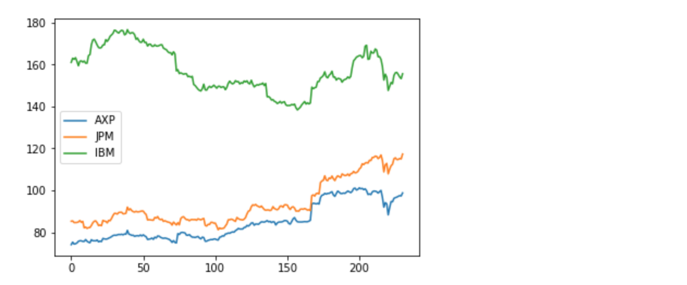
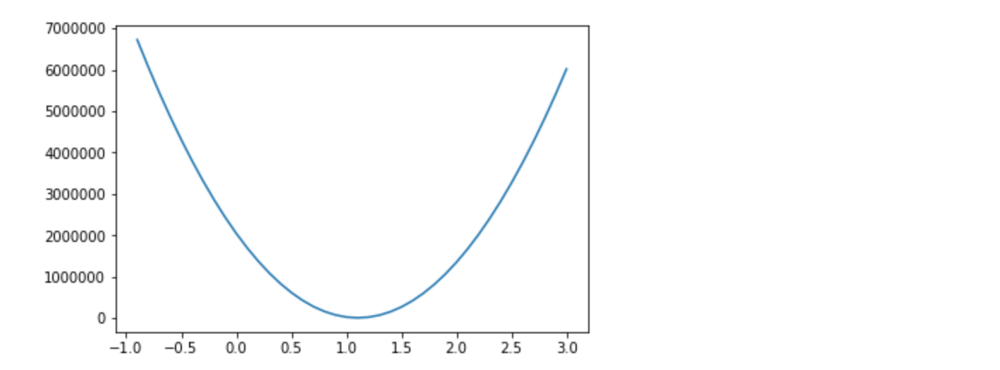

<script type="text/javascript"
        src="https://cdnjs.cloudflare.com/ajax/libs/mathjax/2.7.0/MathJax.js?config=TeX-AMS_CHTML"></script>

# Tensorflow Part II: Linear Regression 

## Goals

- Read Data in memory (csv)
- Placeholder
- Data Slices
- Linear model
- Training loop: gradient descent (manual/Class)
- step size, initial parameters, issues on convergence


## 0. Business case

The goal is to train a linear model to predict JP Morgan `JPM` stock price from the price of other Dow Jones Industrial Index components.

A csv file is provided with the daily price for DJ componentents over a year.

We will first load this data in memory and train the model.

Then we will validate the model and look at the training/validation error evolution.

Finally we will see how to read data in a more iterative fashion.

## 1. Read a csv file in memory

#### Read with pandas
```
import pandas as pd

```

```
fileurl = "https://s3-eu-west-1.amazonaws.com/training180529/data/djia_close.csv"

df = pd.read_csv(fileurl, sep=',',header=0)
```
Using Pandas csv parser, with `,` as separator and line #0 as header.

Plot the scatter plot showing `JPM` as a function of `AXP`, to show there is a degree of correlation.

```
plt.scatter(df[['AXP']], df[['JPM']])
```

What happens if one plots `df[['JPM']]`? What is wrong?

#### Sort by date

Sort by date using the pandas API:

```
df['date'] = pd.to_datetime(df['date'])
df = df.sort_values(by= 'date').reset_index(drop=True)
```

On can call plot directly on a pandas dataframe:

```
df[['AXP', 'JPM', 'IBM']].plot()
```


#### More data cleaning

The following command lists columns conataining any `NaN`. These columns will be dropped in later stages.

```
df.columns[df.isna().any()].tolist()
```

First goal will be to have a linear model where `JPM` is the target and `AXP` the feature.


#### Create constant Tensors

x will contain `AXP` column.

y will contain `JPM` column.

```
with tf.Session() as sess:
        x = tf.constant(df[['AXP']])
        y = tf.constant(df[['JPM']])
```

## 2. Linear model

### Parameters
Define weights tensor variable (init with random_normal, mean = 0, standard deviation = 0.1)

```
weights = tf.Variable(tf.random_normal([1, 1], 0, .1, dtype=tf.float64))
```

Shape is (1, 1) because there is 1 parameter (1 feature) and prediction has dimension 1 (1 float value for the prediction).

We force to type to float64 to match the types of x and y.

No bias to start with.

### Predictions and loss

Predictions are given by \\( \hat{y} = x \omega \\)

And by \\( {y - \hat{y}} \\)

```
    yhat = x @ weights
    yerror = tf.subtract(y, yhat)
```

The loss is the squared sum of prediction errors

```
    loss = tf.reduce_sum(tf.multiply(yerror, yerror))
```

Before any optimisation, compute and display the loss and weights:

```
    tf.global_variables_initializer().run()
    sess.run(loss)
```

The computation graph for `loss` depends on `yerror`, `yhat` and `weights` so they will be computed, no need to run these explicitly.

```
    print(loss.eval())
    print(weights.eval())
```

Obviously, without optimisation of weights, predictions ar far from actual values, as this plot shows:

```
    plt.plot(range(y.eval().shape[0]), y.eval(), 'g-', range(y.eval().shape[0]), yhat.eval(), 'b-')
    plt.plot(yerror, 'r-')
```

#### Exercise:

Looking back at the plot `JPM` vs `APX`, what would be a better parameter? We can force and initial value close to this this random_normal?

Try and look for a better loss value

#### Exercise:

Initialize weight with -1.

Define an `update_weight` operation to add 0.1 to the current weight (using `tf.assign(weights, weights + 0.1)`)

Create a loop to cover [-1, 3] and reevaluate weight and loss.

Store array of weights and loss and plot. Hint:

Initialize bofore session:

```
losses = []
ws = []
```

Append values in loop:

```
losses.append(loss.eval())
ws.append(weights.eval()[0])
```

`loss` is a scalar, we need first dimension of `weights`



### Optimise with Gradient Descent

We need an automatic procedure to find the best weight to minimise the loss. Gradient Descent is a classic method, based on estimating the slope of loss when weights vary, this allows to update weights iteratively.

As a reminder the gradient is given by computing partial derivtives of the Loss:

$$
\hat{y} = \omega \dot{} x + b
$$

```
    yhat = x @ weights + b
```

$$ 
Loss = \frac{1}{2}\sum{(\hat{y}-y)^2}
$$

```
    yerror = tf.subtract(y, yhat)
    loss = 0.5 * tf.reduce_sum(tf.multiply(yerror, yerror))

```

$$
\frac{\partial Loss}{\partial \omega\_i} = \sum{(\hat{y} - y) *x\_i}
$$

```
    gradient = tf.reduce_sum(tf.transpose(tf.multiply(x, yerror)), 1, keep_dims=True)
```

Finally, updating weights is done by jumping in the direction of the gradient by a small amount:

$$
\omega\_i^* = \omega\_i - \gamma \frac{\partial Loss}{\partial \omega\_i}
$$

```
    update_weights = tf.assign_sub(weights, learning_rate * gradient)
```
#### Exercise:

Put it all together, run a number of iterations, choose a learning parameter, a see if you can get convergence.

Plot evolution of loss in the learning process.

### Gradient Descent (`GradientDescentOptimizer`)

Tensorflow provides classes to provide loss functions like L2:

https://www.tensorflow.org/api_docs/python/tf/nn/l2_loss

```
    loss = tf.nn.l2_loss(yerror)
```

and optimizers,  like `GradientDescentOptimizer`:

https://www.tensorflow.org/api_docs/python/tf/train/GradientDescentOptimizer

```
    update_weights = tf.train.GradientDescentOptimizer(learning_rate).minimize(loss)
```

These implementations are equivalent to the detailed one we has used before. 

#### Exercise:

Adapt implementation to use the `tf.nn.l2_loss` operation and `tf.train.GradientDescentOptimizer`.

