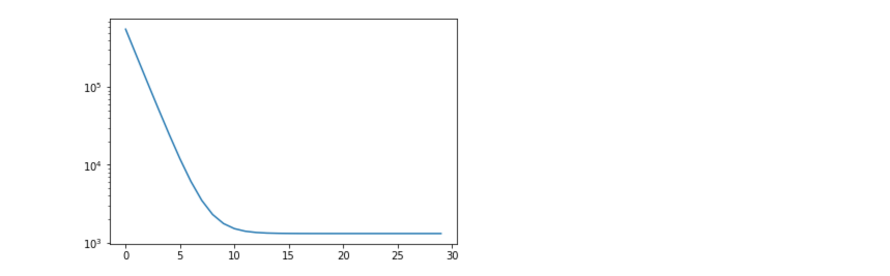

<script type="text/javascript"
        src="https://cdnjs.cloudflare.com/ajax/libs/mathjax/2.7.0/MathJax.js?config=TeX-AMS_CHTML"></script>

# Tensorflow Part III: More on Linear Regression 

## Goals

- Work with Training/Validation set
- Compute Loss, RMSE
- Placeholders
- Tensorflow DataSet
- Estimators

## 3. Validation


We start from the previous implementation:

```
import tensorflow as tf
import numpy as np
import matplotlib.pyplot as plt
import pandas as pd
```

```
fileurl = "https://s3-eu-west-1.amazonaws.com/training180529/data/djia_close.csv"
df = pd.read_csv(fileurl, sep=',',header=0)
df['date'] = pd.to_datetime(df['date'])
df = df.sort_values(by= 'date').reset_index(drop=True)
```

```
learning_rate = 1e-8
training_steps = 10000
losses = []

with tf.Session() as sess:
    x = tf.constant(df.drop(columns=['date', 'JPM', 'DWDP', 'MMM']))
    #x = tf.constant(df[['AXP']])
    y = tf.constant(df[['JPM']])
    
    weights = tf.Variable(tf.random_normal([27, 1], 0, .1, dtype=tf.float64))
    
    b = tf.Variable(tf.random_normal([1], 0, 0.1, dtype=tf.float64))
    
    tf.global_variables_initializer().run()
    yhat = x @ weights + b
    yerror = tf.subtract(yhat, y)
    
    loss = tf.nn.l2_loss(yerror)
    update_weights = tf.train.GradientDescentOptimizer(learning_rate).minimize(loss)
    
    for _ in range(training_steps):
        # Repeatedly run the operations, updating the TensorFlow variable.
        sess.run(update_weights)
        losses.append(loss.eval())
        #print(gradient.eval())
    betas = weights.eval()
    bias = b.eval()
    yhat = yhat.eval()
    y = y.eval()

```

```
print(bias)
print(betas.reshape(27))
```

```
plt.yscale('log')
plt.plot(range(0, training_steps), losses)
```



### Training/Validation sets

We see the optimiser reduces the Loss which is computed on the training data. We would like to know the quality of the model on new data. For this we must train on part of the data (e.g. 2/3) and measure model quality on the remaining data.

We start by splitting the dataframe `df``as a training set and test set.

```
train=df.sample(frac=0.66)
test=df.drop(train.index)
```

Then we create the corresponding tensorflow variables:

`x_train`, `y_train`

and

`x_test`,  `y_test`

#### Exercise 

Run a the training minimising the training set loss. Compute the Root Mean Squared Error on the test and training set.

$$
RMSE = \sqrt{\frac{1}{n}\sum{(y-\hat{y})^2}}
$$

Tips:

- RMSE is the square root of the mean squared error, and sum of squared errors is the Loss as calculated before (L2).

- Square root function from `math` module:

```
import math
math.sqrt(...)
```

Compare RMSE for training and test set, why the difference? Which validation set is the most relevant?


#### Exercise 

Use as training set the first 2/3 of the dates (no random pick), and test set is the last 1/3 of the time series.

Again, compare the RMSE and explain the difference.


e.g.

-

$$
\begin{matrix}
Set & RMSE \\\
\hline
Training (Random) & 0.83 \\\
Validation (Random) & 0.93 \\\
Validation (Sequence) & 1.50
\end{matrix}
$$

-

#### Exercise

There is a `tf.metrics.mean_squared_error` function:

https://www.tensorflow.org/api_docs/python/tf/metrics/mean_squared_error

Modify the notebook to use this function to report RMSE.

## 4. TensorFlow Dataset

We will now consume data in an iterative fashion, using the Dataset API of tensorflow.

### !!! Save a csv file !!!

First, we need to save the pandas dataframe as csv, for exampe in `/tmp/djia.csv`, because tensorflow will not read http directly. We will clean, removing unused columns (`date`, `DWDP`, `MMM`):

```
fileurl = "https://s3-eu-west-1.amazonaws.com/training180529/data/djia_close.csv"
df = pd.read_csv(fileurl, sep=',',header=0)
df['date'] = pd.to_datetime(df['date'])
df = df.sort_values(by= 'date').reset_index(drop=True)
df = df.drop(columns=['date', 'DWDP', 'MMM'])
df.to_csv("/tmp/djia.csv", index=False)
```
### Create a Datasetfrom text file list

From a list of strings (file paths to process), we can create a DataSet to iterate on:

```
dataset = tf.data.TextLineDataset(["/tmp/djia.csv"])
next_batch = dataset.make_one_shot_iterator().get_next()
```

We ca then start a session to evaluate the iterator content:

```
with tf.Session() as sess:
    print(next_batch.eval())
    print(next_batch.eval())
```

<pre>
b'AAPL,AXP,BA,CAT,CSCO,CVX,DIS,GE,GS,HD,IBM,INTC,JNJ,JPM,KO,MCD,MRK,MSFT,NKE,PFE,PG,TRV,UNH,UTX,V,VZ,WMT,XOM'
b'114.71537780152,74.16224571766,152.66844275663001,91.25808662690599,29.484965671049,114.38156665191002,105.28539325843,30.870473498417002,239.29823013253,131.9449566362,160.9398519008,35.391922524826995,112.92508726248998,85.302395106747,40.770394346462005,117.32181346847,58.853858943354,61.219141839548996,51.465478270011,31.756235679156,81.645970701032,120.23555081617586,159.58128575795,108.92922976027,79.081714790902,53.35930858124178,67.291215387444,87.56724123866199'
</pre>

#### Exercise:

Use the `skip` function on TextLineDataset to remove the header line.

Use the `batch` function to group by 10 lines in one itaration.


### Decode the csv, construct feature/label
`value`can be decoded as csv, using `tf.decode_csv`. It returns a list of tensors, and requires `record_defaults` as a python list for default values and types.

For example, the following csv line

```
1.23,2.33,3.23
```

can be decoded with:

```
decoded = tf.decode_csv(value, record_defaults = [[0.0], [0.0], [0.0]])
```

Note the `record_defaults` structure, giving the shape and types of decoded items.

#### Exercise

How to write a decoded for the djia.csv file?
Hints to create `record_defaults`:

- `[[ ]] * 3` creates the nested list `[ [ ], [ ], [ ] ]`

#### Exercise


Write a function to decode a line and create a tensor *stacking* the different fields, first one being JPM:

```
def parse_csv(line):
  ## TODO: implement in order to get a tensor stacking the list of 
  ## prices, with JPM as first element
  
  all_cols = ???
  return tf.stack(all_cols)
```

This function will be applied on the `dataset` via a `map`, then batching by 10 elements:

```
next_batch = dataset.map(parse_csv).batch(10).make_one_shot_iterator().get_next()
```

Write a transformation of `next_batch` to return a tuple `y_batch, x_batch` where `y_batch` contains the values of JPM, and `x_batch` the values of other stocks.

Use the `tf.slice` function for this, result should look like this (here on a batch of size 1!):

```
with tf.Session() as sess:
    #print(next_batch.eval())
    x, y = sess.run([next_x, next_y])
    print(y)
    print(x)
```

```
[[85.3024]]
[[114.71538   74.16225  152.66844   91.25809   29.484966 114.38157
  105.28539   30.870474 239.29823  131.94496  160.93985   35.391922
  112.92509   40.770393 117.321815  58.85386   61.219143  51.465477
   31.756235  81.64597  120.23555  159.58128  108.92923   79.08172
   53.35931   67.291214  87.56724 ]]
```

### Batch to update 

Loop on 10 iterations, and check there are updated batches!

## 5. Train the Linear Model in mini-batches...

Left as exercise:

- Train the model using these mini-batches (100 samples)

## 6. Estimator based implementation
<span style="color: red"> TODO FULL DETAILED EXAMPLE OF MANAGING DATASET TO LINEARREGRESSOR USGE</span>
Tensorflow provides the estimator API wrapping differents model actions:

- training
- evaluation
- predictions
- saving 

A LinearRegressor is implemented (see [https://www.tensorflow.org/api_docs/python/tf/estimator/LinearRegressor]()).

Estimators separate data preparation pipelines from model training and use.

Estimators provide a LinearModel implementation:

https://www.tensorflow.org/api_docs/python/tf/estimator/LinearRegressor

The LinearRegressor requires 