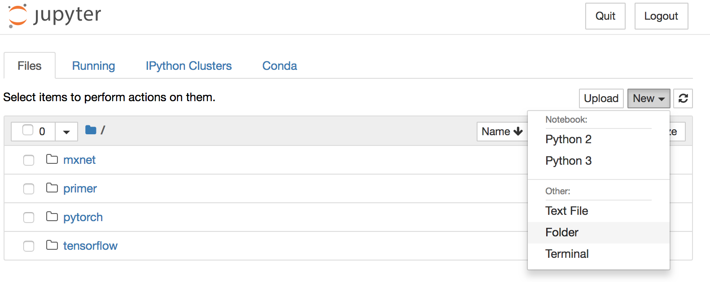
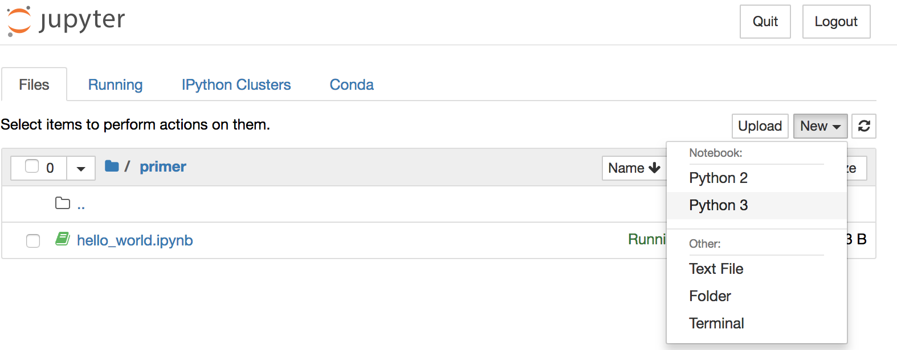
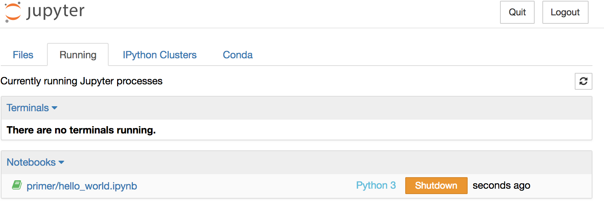
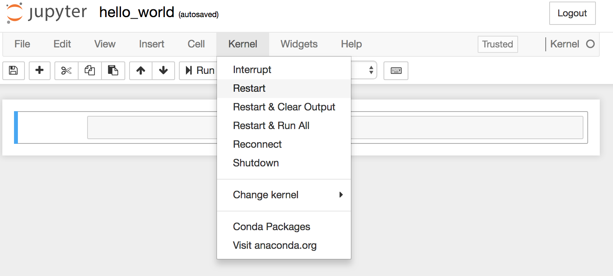
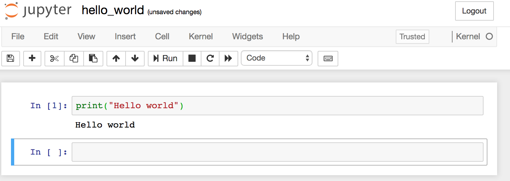
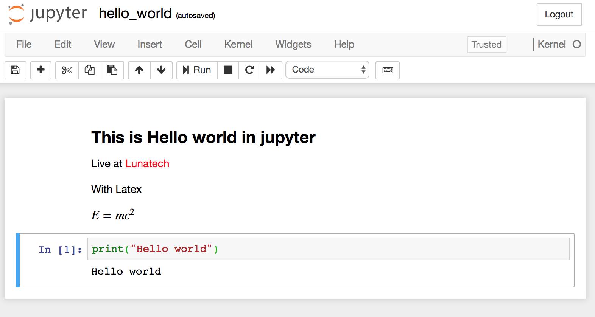
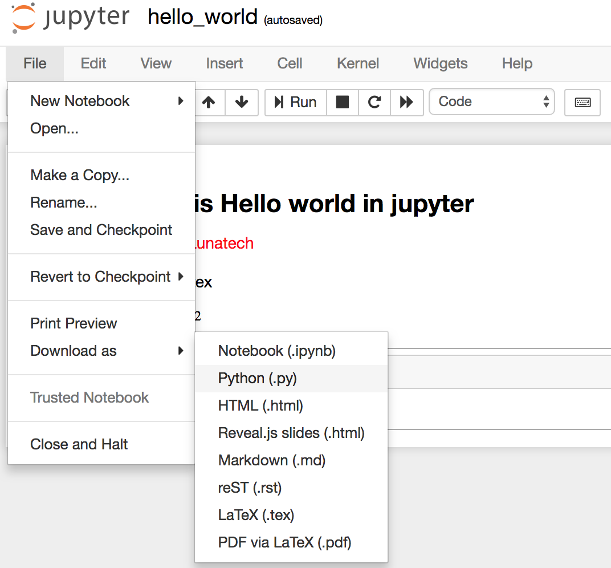
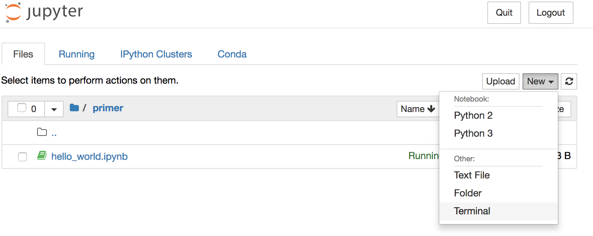
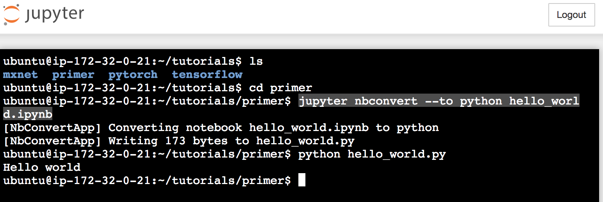
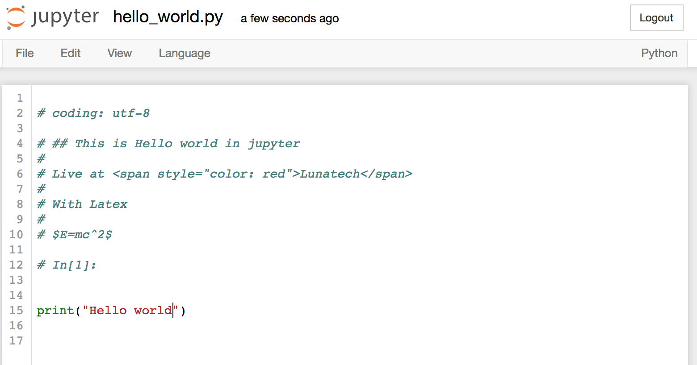

# Jupyter primer

## Goals

- Jupyter server:

	- Browse notebook
	- create directories
	- create notebooks
	- shutdown notebooks

- Notebook:
	- Kernel start/stop
	- Create, delete cells
	- Execute cells	
	- Edit markdown cells
	- Toggle output
	- Save cycle

- Jupyter command:
	- open a terminal
	- convert notebook to script
	- run script

## Jupyter Server

#### 1. Open the Jupyter server in a Browser:

[http://xxxxx:8888]()

Where xxx is your assigned machine name

#### 2. Create a new directory

Name this directory, for example `primer`:




Move into this new directory to:

#### 3. Create a new notebook with `python3` as Kernel.

Rename this notebook as `hello_world` for example.



#### 4. Look at `running` notebooks in the Server page

- Do a shutdown of `hello_world`:



## Jupyter Notebook

#### 1. Kernel operations

Go back to the `hello_world` notebook page and restart the `kernel` (see Kernel menu for options and Kernel status):



#### 2. Cell edit/execution

Click on a cell to edit its content:

```
print("Hello world!")
```

Execute a cell with `ctrl-return`. `stdout` is displayed as cell output. (see how clear cells output).

#### 3. New cells, move cells

Execute with `shift-return` to go to next cell or create a new one if last cell:



Create a cell below: `esc + b`

Create a cell above: `esc + a`

Use arrows buttons to move cells up and down.

Delete a cell (carefully!!) with `esc + dd`

#### 4. Annotations with markdown

Edit a `Markdown` Cell (Cell -> Cell type) with a title, some style, some latex (`$E=mc^2$`)...

#### 5. Save the notebook



If notebook is to be used in git or converted as a script, clear cells output before saving!

## Jupyter Terminal and conversion

#### 1. Download notebook as python script

This method allows you to get a copy of the notebook executable as a script, but on the browser local directory.
Resources available on the jupyter server are not the same!



#### 2. Open a terminal in Jupyter server

Working with a jupyter terminal gives you access to the server resources (e.g. hardware, including gpus) and environment including libraries.



#### 3. Convert the `hello_world` notebook

In the terminal, change to `primer` directory and execute `jupyter` command to convert to a python script:

```
jupyter nbconvert --to python <notebook name>.ipynb
``` 

This will create a python script to be executed:

```
python <notebook name>.py
```

Here is an axample of session:



#### 4. Close the terminal (`Running` tab of Jupyter server page)

Note also how the python script (`hello_world.py`) is available for edition on the Jupyter page.




 